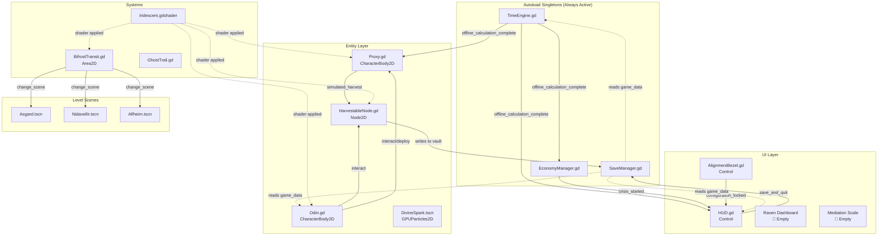

# System Architecture Map

**Category:** Architecture — Technical Overview
**Status:** Living Document

---

## 1. High-Level Architecture



---

## 2. Signal Graph

| Signal | Source | Subscribers | Data |
|:-------|:------|:-----------|:-----|
| `offline_calculation_complete` | `TimeEngine` | `Proxy`, `EconomyManager`, `HUD` | `duration_seconds: float` |
| `crisis_started` | `EconomyManager` | `HUD` | `crisis_name: String, modifier: float` |
| `configuration_locked` | `AlignmentBezel` | `HUD` | `config: Dictionary` |

---

## 3. Data Flow

### On Boot
```
OS Clock → TimeEngine → offline_duration
                ↓
    SaveManager.game_data ← loaded from JSON
                ↓
    Proxy._on_offline_catch_up() → HarvestableNode.simulated_harvest()
    EconomyManager.update_economy_state() → crisis check
    HUD._on_offline_time_calculated() → display duration
```

### On Save & Quit
```
Odin.global_position → SaveManager.game_data["player_pos"]
SaveManager.save_game() → write JSON with current timestamp
get_tree().quit()
```

### On Bifrost Transit
```
Odin enters BifrostTransit Area2D → save game → change_scene_to_file()
```

---

## 4. Singleton Dependency Order

| Priority | Singleton | Depends On | Reason |
|:---------|:----------|:-----------|:-------|
| 1 | `SaveManager` | None | Must load data before anything reads it |
| 2 | `TimeEngine` | `SaveManager` | Needs `offline_start_time` from save data |
| 3 | `EconomyManager` | `TimeEngine` | Connects to `offline_calculation_complete` signal |

The `project.godot` autoload order must match this. `TimeEngine._ready()` uses `await get_tree().process_frame` to ensure `SaveManager` has loaded first.

---

## Active Task List

- [ ] Add planned singletons: `ChaosManager.gd`, `DialogueParser.gd`
- [ ] Formalize autoload order in `project.godot` (currently implicit via await)
- [ ] Document all planned signals for Chaos and Dialogue systems
- [ ] Create a visual scene tree reference for each level

---

## AI Changelog

| Date | Change | Reasoning |
|:-----|:-------|:----------|
| 2026-04-15 | Created System Architecture Map with full signal graph, data flow diagrams, and singleton dependency order. | This is the "map" for agentic development — any future code generation must reference this to know what signals to connect, what data to read, and what singletons exist. |
