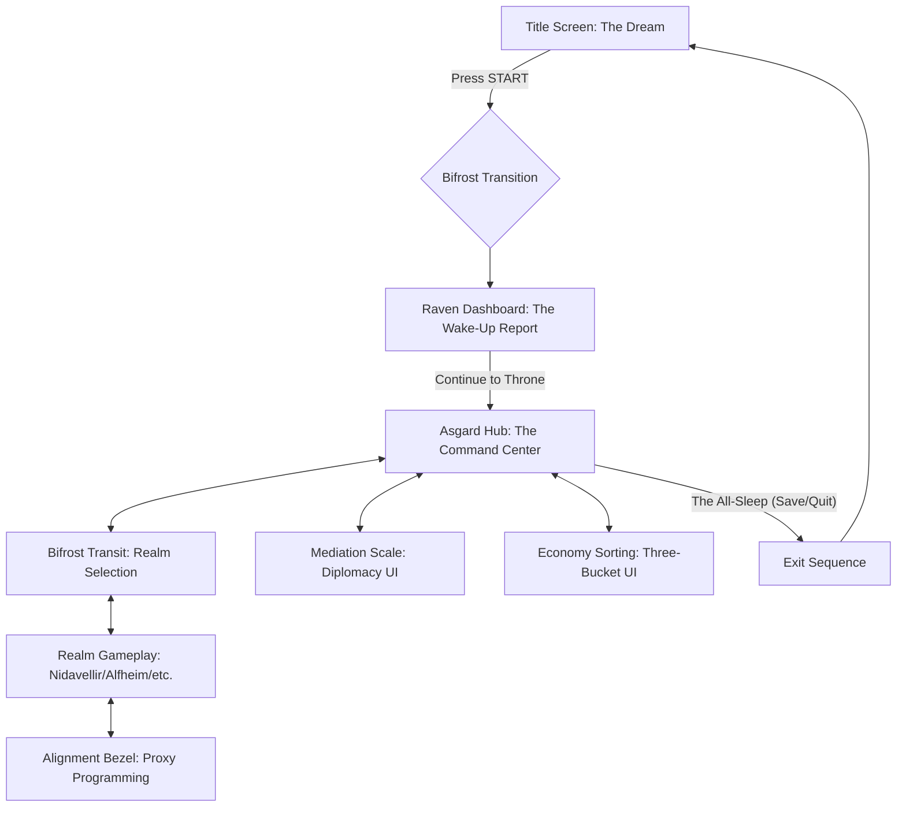

# 🖥️ Screen Workflow & User Journey

**Category:** Architecture / UI
**Status:** Initial Draft — Implementation In Progress
**Related Code:** `TitleScreen.gd`, `SaveManager.gd`, `RavenDashboard.gd`

---

## 1. The Divine Journey (Workflow Diagram)

This diagram tracks the player's movement between the dream (Off-line) and the duty (On-line).

---

## 2. Screen Descriptions & Technical Requirements

### A. The Dream (Title Screen)
*   **Purpose**: Establish the mood and wait for player input.
*   **Visuals**: High-fidelity art of Odin sleeping (title_screen.png).
*   **Transition**: A full-screen "Bifrost Flash" (White/Rainbow fade-out).

### B. The Wake-Up Report (Raven Dashboard)
*   **Purpose**: Provide immediate feedback on offline progress.
*   **Trigger**: Automatically appears upon first loading the game or transitioning from the Title Screen.
*   **Key Data**: Offline duration, total resources earned, total chaos delta.

### C. The Command Center (Asgard Hub)
*   **Purpose**: The central logistical node.
*   **Interactions**: Access to the Bifrost Terminal, The Proxy Smithing Bench, and the Mediation Table.
*   **HUD**: Displays the "Harmony Gauge" and current Runic Stamina.

### D. The precision Overlays (Mini-Games)
*   **Purpose**: Focused interaction screens that pause world movement.
*   **Alignment Bezel**: 3-ring chronograph logic for setting proxy efficiency.
*   **Mediation Scale**: Weight-based UI for balancing realm grievances.

### E. The Exit Sequence (The All-Sleep)
*   **Purpose**: Save the game and prepare the player for their real-world sleep.
*   **Visuals**: Odin sits on the throne and slowly closes his eye. The world fades to the Title Screen art.

---

## 3. Visual Consistency & "Juice"

To maintain the "The All-Sleep" aesthetic, all screens must share these visual anchors:
*   **Border Motif**: Dark metal frames with neon runic inserts.
*   **Transitions**: No hard cuts. Use "Rainbow Smears" or "Bifrost Beams" for all scene changes.
*   **Sound**: Deep, low-frequency atmospheric hums for UI interactions.
